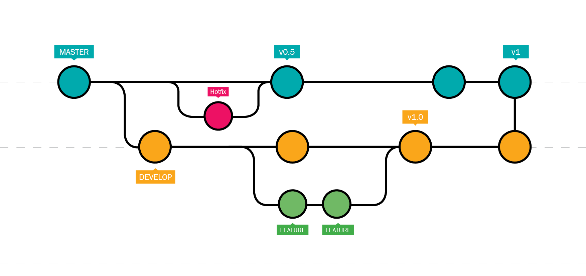
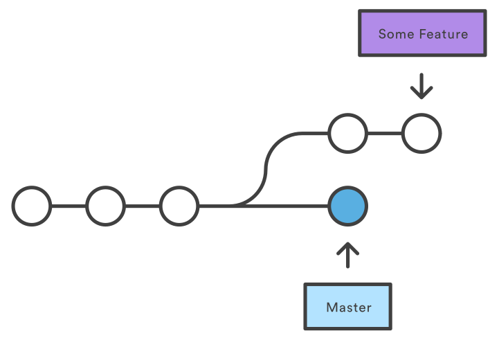
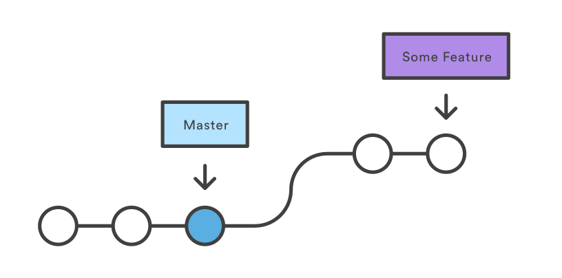
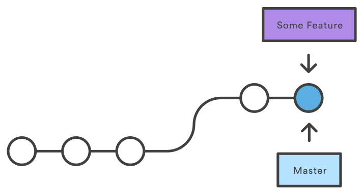

<!--
  $theme: default
  pretender: true
  footer: Matthias Hryniszak - Meet.js 2018-11-21
-->

<!--
  *footer: 
-->

# Parallel frontend deployment
###### for continuous integration and deployment

<br><br>

#### by Matthias Hryniszak

---

---

<div style="text-align: center">

  

</div>

---

# Continuous deployment

---
 
<div style="text-align: center">
  <h3>Continuous deployment parts</h3>
  <br/>
</div>

* Version control
* CI/CD automation
* Runtime environment

---

# Version control

---

<div style="text-align: center">
  <h3>Git workflow</h3>
  
</div>

---

<div style="text-align: center">
  <h3>Git workflow - explained</h3>
  
</div>

---

# Fixing git workflow

---

<div style="text-align: center">
  <h3>Git workflow - fixed - step 1</h3>
  <br/>
  
  <br/>
  <br/>
</div>

```bash
$ git checkout -b feature-branch
...
$ git commit
$ git pull --rebase
$ git push
```

---

<div style="text-align: center">
  <h3>Git workflow - fixed - step 2</h3>
  <br/>
  
  <br/>
  <br/>
</div>

```bash
$ git fetch origin
$ git rebase origin/master
$ git push --force
```

---

<div style="text-align: center">
  <h3>Git workflow - fixed - step 3</h3>
  <br/>
  
  <br/>
  <br/>
</div>

```bash
$ git checkout master
$ git pull
$ git merge --ff-only feature-branch
```

---

# CI/CD automation

---

<div style="text-align: center">
  <h3>CI/CD automation</h3>
  <br/>
</div>

* Jenkins ([Pipeline Multibranch Plugin](https://wiki.jenkins.io/display/JENKINS/Pipeline+Multibranch+Plugin))
* Team City ([Working with multiple branches](https://confluence.jetbrains.com/display/TCD10/Working+with+Feature+Branches))
* TFS ([Build multiple branches](https://docs.microsoft.com/en-us/azure/devops/pipelines/build/ci-build-git?view=vsts&tabs=yaml))
* Bamboo ([Using plan branches](https://confluence.atlassian.com/bamboo/using-plan-branches-289276872.html))
---

# Runtime environment

---

<div style="text-align: center">
  <h3>Runtime environment - backend</h3>
  <br/>
</div>

* Multiple processes (HTTP server, queues, database,...)
* Runs in isolation from the client (on the server)
* Runs on managed hardware (or in the cloud)
* Deployment requires restart of server process
* High availability is managed through clever load balancing
* Managing backend version requires clever load balancing
* **Slow change ratio**

---

<div style="text-align: center">
  <h3>Runtime environment - frontend</h3>
  <br/>
</div>

* One process (the browser)
* Runs in isolation from the server
* Runs on client hardware
* Deployment is potentially done on every page refresh
* **Very rapid change ratio**

---

# Development flow

---

<div style="text-align: center">
  <h3>The development flow</h3>
  <br/>
</div>

* **Backend first** - fully deployed and tested
* **Then frontend** - building on top of backend services

---

# Parallelizing frontend deployments 

---

<br/><br/>
<div style="text-align: center">
  <h3>Baibulo*</h3>
  <br/>
</div>

* Node.js (https://www.npmjs.com/package/baibulo)
* Java/JavaEE (com.aplaline.baibulo:baibulo:1.0.6)
* .NET (https://www.nuget.org/packages/baibulo-net)

<br/><br/><br/><br/>

<div style="text-align: right; font-size: 20px">
  * "baibulo" means "version" in Chewa
</div>

---

<div style="text-align: center">
  <h3>Baibulo - Node.js</h3>
  <br/>
</div>

```javascript
const app = require('express')()
const cookieParser = require('cookie-parser')
const baibulo = require('baibulo')

app.use(cookieParser())

app.use(baibulo({ root: '/var/lib/my-project' }))

app.listen(3000, () => {
  console.log("Listening for requests on ports 3000\n");
})
```
---

# Usage

---

<div style="text-align: center">
  <h3>Accessing different versions</h3>
  <br/>
</div>

* Specific branch:
http://server/path?version=branch-name

* Release version:
http://server/path
http://server/path?version=release

---

<div style="text-align: center">
  <h3>Version discovery scheme - GET</h3>
  <br/>
</div>

* `version` query string param
* `Version` HTTP header
* `version` query string param in `Referer` header
* `__version` cookie
* defaults to `release`

---

<div style="text-align: center">
  <h3>Version discovery scheme - GET</h3>
  <br/>
</div>

* Once the first request is made the `__version` cookie is set
* Following requests inherit version from the first request

---

<div style="text-align: center">
  <h3>Version discovery scheme - PUT</h3>
  <br/>
</div>

* `version` query string param
* `Version` HTTP header

---

# Deployment of a file in a version

---

Using header:

```bash
$ curl -v -X PUT \
  --data-binary "@image.png" \
  -H "Version: TST-123" \
  http://server/assets/image.png
```

<br/>

Using query string param

```bash
$ curl -v -X PUT \
  --data-binary "@image.png" \
  http://server/assets/image.png?version=TST-123
```

---

<br/><br/><br/><br/>

Using `baibulo-deploy` utility

```bash
$ baibulo deploy \
  --dir dist \
  --url http://server/assets \
  --version=TST-123
```

<br/><br/><br/><br/>

<div style="text-align: right; font-size: 20px;">
  <a href="https://www.npmjs.com/package/baibulo-deploy">
    https://www.npmjs.com/package/baibulo-deploy
  </a>
</div>

---

# Security

---

<div style="text-align: center">
  <h3>Upload-only server</h3>
  <br/>
</div>

```javascript
const app = require('express')()
const baibulo = require('baibulo')

app.use(baibulo({
  root: '/var/lib/my-project',
  download: false,
  upload: true,
}))

app.listen(3001, () => {
  console.log("Listening for uploads on ports 3001\n");
})
```

---

<div style="text-align: center">
  <h3>Download-only server</h3>
  <br/>
</div>

```javascript
const app = require('express')()
const cookieParser = require('cookie-parser')
const baibulo = require('baibulo')

app.use(cookieParser())

app.use(baibulo({
  root: '/var/lib/my-project',
  download: true,
  upload: false,
}))

app.listen(3000, () => {
  console.log("Listening for requests on ports 3000\n");
})
```

---

# Storage

---

<div style="text-align: center">
  <h3>Storage - how versions are stored on disk</h3>
  <br/>
</div>

```bash

/storage-root/folder/filename/version

```

```bash

/var/lib/my-project/index.html/release
/var/lib/my-project/index.html/TST-123

/var/lib/my-project/styles/styles.css/release
/var/lib/my-project/styles/styles.css/TST-123

```

---

# Implications

---

<div style="text-align: center">
  <h3>Implications</h3>
  <br/>
</div>

* DevOps can easily implement continuous deployment
* Only one server is needed to host **all** versions
* Product owners can decide if the feature is going as planned
* Testers can **always** test what is **really** going into production
* Developers can easily integrate with upstream changes
* Single point fast-forward final merges without merge conflicts
* **Clear** and **linear** change history on master
* Ability to use `git bisect` to find troublesome commits

---

<div style="text-align: center">
  <h3>Using remote repo browsers testers can actually merge!</h3>
</div>

---

# Incremental implementation

---

<div style="text-align: center">
  <h3>Incremental implementation</h3>
  <br/>
</div>

1. Implement versioning on integration servers
2. (optional) Implement versioning on pre-production servers
3. (optional) Implement versioning on production servers

---

# The Future

---

<br><br>

<div style="text-align: center">
  <h3>Planned improvements</h3>
  <br/>
</div>

* Multiple storage options (S3, Redis, relational databases)
* ETag handling
* Removal of old versions
* Python implementation 
* Ruby implementation

<br><br>

<div style="text-align: right; font-size: 20px">
  Contributions are welcomed!
</div>

---

# Questions?

---

# May the force be with you!

Blog:
https://padcom13.blogspot.com

LinkedIn:
https://linkedin.com/in/padcom

This presentation:
https://bit.ly/2Q81iv2
